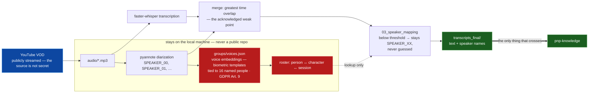

# Stage 1: audio → speaker-labeled transcript

This describes `pnp-crawl`, the first stage of the pipeline, which is **not
published**. It derives speaker voice embeddings — biometric templates tied to
named individuals (GDPR Art. 9) — plus a roster mapping people to characters and
sessions. The session recordings themselves are public; deriving that data from
public audio does not make it public, so the stage that holds it stays private.

This document exists so the architecture is reviewable without the code.

## Shape

```
YouTube URLs / playlist
        │  01_download.py      yt-dlp → mp3 + .meta.json sidecar
        ▼
   audio/*.mp3
        │  02_transcribe.py    faster-whisper + pyannote diarization, merged
        ▼
transcripts_raw/*.json         SPEAKER_00, SPEAKER_01, …
        │  03_speaker_mapping.py
        ▼
transcripts_final/*.json+txt   real names, resolved per session date
```

Three numbered stages, each reading the previous stage's output directory. Every
stage is idempotent — already-processed files are skipped — so re-running after
adding sessions is always safe. `run_pipeline.py` chains all three *per video*,
so each recording completes end to end before the next begins.

The data-classification decision is easier to see than to read. Nothing inside
the dashed boundary has an outgoing edge:



The public source is drawn as public on purpose. Claiming the recordings are
private would be disprovable in one search; the defensible claim is the narrower
and more interesting one — a template derived from public audio is new data, and
its sensitivity is not inherited from the source.

## Design decisions worth naming

### Crash-safety at chunk granularity, not file granularity

Transcription of a multi-hour recording is long enough that losing a run to a
crash is a real cost. Each video gets a work directory holding a chunk plan plus
per-chunk Whisper, diarization, and merged caches. A resumed run reloads
completed chunks — and even a finished half of an in-progress chunk — from disk.
The work directory is deleted only once the final transcript is committed.

**The chunk plan stores each chunk's true start offset.** An earlier version
derived the next offset from the previous segment's end time, which accumulated
error across a long recording and pulled every timestamp progressively out of
alignment. The fix was to make offsets absolute rather than relative, and the
constraint is now recorded at the point where someone would be tempted to undo
it. Drift bugs are cheap to reintroduce and expensive to notice, because the
output stays plausible.

### The merge step is the acknowledged weak point

Whisper produces text segments; pyannote produces speaker turns. They do not
share boundaries. The merge assigns each text segment to whichever speaker has
the greatest time overlap.

This is the most fragile part of the pipeline and is documented as such in the
repo rather than presented as solved. Greatest-overlap is a heuristic: it
degrades on interruptions, crosstalk, and short backchannel utterances, which a
tabletop recording produces constantly. It is good enough because a downstream
human pass exists, and the honest description of it is part of the design.

### Refusing to guess below the confidence threshold

Stage 3 resolves each anonymous `SPEAKER_XX` label to a real person, either by a
group-composition heuristic or by voice-matching against stored embeddings.

Below the match threshold, **the label is left as a literal `SPEAKER_XX`
placeholder rather than filled with a best guess**, and the run summary lists
which sessions still need manual attention. A wrong name propagates silently into
the knowledge base, where it becomes an entity attribution that later contradicts
another session; an obvious placeholder does not. Making the uncertainty visible
downstream is worth more than the convenience of a filled field.

### Per-session group resolution

A session's group comes from a per-video record, not from global configuration,
because one run can span two campaigns. Auto-generated entries are flagged in the
run summary: a wrong attendee count means diarization was pinned to the wrong
speaker count and that session needs re-transcribing. The check is cheap and
catches a failure that is otherwise invisible until the transcript reads wrong.

## What crosses the boundary

Only `transcripts_final/` reaches `pnp-knowledge`. Voice embeddings, the roster,
and the person↔character mapping stay in stage 1 and are never committed to a
public repository.

Transcripts do carry speaker names — the campaign is publicly streamed, so who
spoke is public information. The biometric templates that make automatic
recognition possible are a separate artifact and stay behind.

## Known limits

| Limit | Consequence |
|---|---|
| Greatest-overlap merge | Misattribution on crosstalk and interruptions |
| Whisper on German domain vocabulary | Invented names for in-world terms; corrected downstream via the spelling ratchets |
| Voice match needs prior enrollment | A new player is `SPEAKER_XX` until manually mapped once |
| Single test file, plain asserts | Transcription and merge logic are validated by inspecting output, not by tests |
