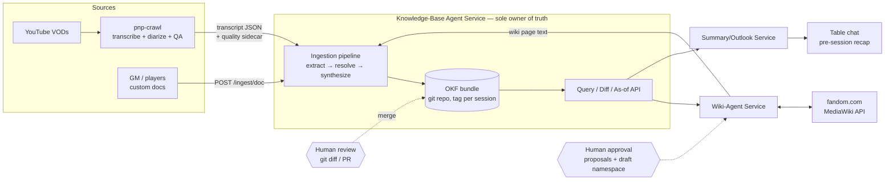
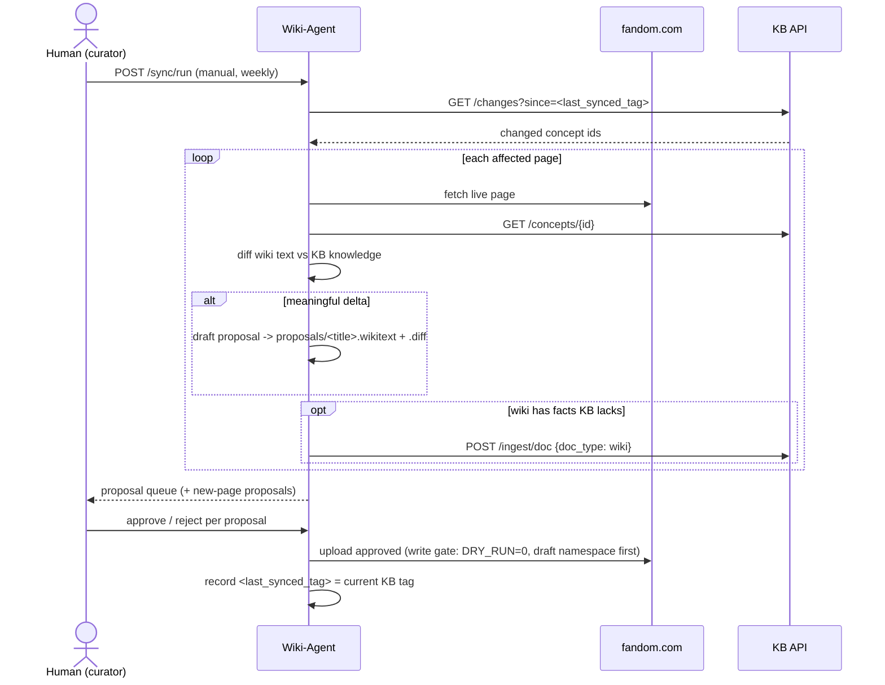
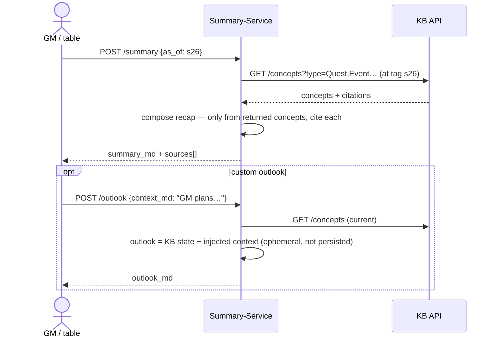

# P&P Campaign Knowledge System — Architecture & Program Plan

Companion to [ADR-001](ADR-001-knowledge-layer.md) (OKF bundle in git = system of record). Date: 2026-07-22.

## 1. Inventory — what exists vs. the target

| Target piece | Exists today | State |
|---|---|---|
| Transcript pipeline | `pnp-crawl` | Built. 3 stages + QA audit scripts. **Gap:** final JSON has no quality score / `unsicher` markers (verified) — the signal the KB ingestion is supposed to weight is not machine-readable yet. |
| Session reports | `pnp-report` | 26 curated German reports + roll CSVs, typed-ID vocabulary (`CHAR_/NPC_/LOC_/…`) — becomes the KB's canonical ID vocabulary. |
| KB — GraphRAG candidate | `pnp-graph-service` | Mature: resolver/alias registry, bitemporal edges, vector retrieval, report reconciliation. Per ADR-001: source of the identity-layer design + future derived index; not the system of record. |
| KB — OKF candidate | `okf-experiments-main` | Full-campaign bundle generated (42 sessions). Pipeline becomes the core of the KB service after porting the identity layer. ⚠ housekeeping: it's an unzipped `-main` drop (nested dir, committed `.venv`, a real `.env` with Azure credentials sitting in it) — make it a proper repo, never commit `.env`. |
| OKF spec + tooling | `knowledge-catalog` | Vendored Google reference (spec v0.1, viz, reference agent). Read-only dependency. |
| Wiki agent | `pnp-fandom-service` | Skeleton: MediaWiki client + inventory stage + DRY_RUN/draft-namespace write gate built; extract/generate stages are stubs. Re-target them to read from the KB API instead of `reports/`. |
| Summary/outlook service | — | Missing entirely. |
| KB service API layer | — | Missing (prototypes are batch CLIs, no APIs). |

## 2. Context diagram



## 3. Containers & responsibilities

All services run on the existing local Windows box. Python + FastAPI throughout; each service keeps its own venv.

### 3.0 Repo layout (decided 2026-07-22)

Two repos total. `pnp-crawl` stays standalone. Everything else is maintained and tracked in the **`pnp-graph-service` monorepo** (private, `TimTyriell/pnp-graph-service`):

```
pnp-graph-service/
├── src/pnp_graph/        # existing GraphRAG pipeline (frozen; future derived index)
├── services/
│   ├── kb/               # KB service: pnp_okf pipeline + (P2) FastAPI  ← from okf-experiments
│   ├── fandom/           # wiki agent                                   ← from pnp-fandom-service
│   └── summary/          # (P2) summary/outlook service
├── knowledge/            # SYSTEM OF RECORD: OKF bundle + entity_registry.yaml
│   ├── bundle/splitter_des_ewigen/
│   ├── conflicts/        # (P1) open cross-source contradictions
│   └── sources/          # campaign book + (P1) ingested custom docs
├── reports/              # all 26 session reports + rolls/ CSVs (absorbed from pnp-report)
└── docs/architecture/    # ADR-001, this document
```

Consequences of the single-repo choice: session tags (`s27`) share the repo with code tags — keep code untagged or prefixed (`rel-*`); the `/changes` API and knowledge review diffs are always path-scoped (`-- knowledge/`); knowledge-ingest branches (`ingest/s27`) must touch only `knowledge/`. The standalone folders `pnp-fandom-service/`, `okf-experiments-main/`, `pnp-report/` on disk are now legacy working copies — the monorepo is canonical.

### 3.1 KB service — `services/kb/` (absorbs `pnp_okf` pipeline)

- **Owns:** the OKF bundle (`knowledge/bundle/splitter_des_ewigen`), the entity/alias registry, the ingestion pipeline, all APIs below.
- **Write model:** every ingest runs on a branch (`ingest/s27`), commits proposed concept edits + `conflicts/` entries, and stops. A human reviews the diff and merges; merge to `main` + session tag = knowledge accepted. **No path writes to `main` directly.** This is the KB's human-in-the-loop gate.
- **Reads are always from `main`** (or a tag, for as-of).

### 3.2 Wiki agent — `services/fandom/` (extended)

One service, **two modules** — not two services. The risk isolation the read/write split is meant to buy comes from the already-built gate (DRY_RUN default-on, `--apply` + env flag, draft namespace) and from credential scope (read needs no bot login), not from a process boundary; two deployables on one box is pure overhead. Revisit only if the read side ever becomes a public/always-on endpoint.

- **read module** (`wiki_client.read`, stage 01): page inventory + content fetch, cached in `wiki_cache/`. Also serves the KB's wiki-ingestion needs (see §5, pull model).
- **write module** (stages 03/04): drafts proposals, uploads only after approval, always via the existing gate.

### 3.3 Summary service — `services/summary/` (new, small)

Stateless client of the KB API. Generates recap (grounded, cited) and optional outlook. No persistence beyond output files.

## 4. API contracts (sketch)

### 4.1 KB service

```
GET  /concepts/{id}                  # id = typed ID (NPC_HEXE) or path (npcs/hexe)
     ?as_of=s26                      # read from git tag instead of main
  -> { id, path, frontmatter{type,title,description,tags,timestamp},
       body_md, citations[], links[] }

GET  /concepts?type=NPC&tag=…        # filtered listing from index/frontmatter
GET  /search?q=…                     # phase 2: local embeddings over concepts

GET  /changes?since=s25[&until=s26]  # git diff between refs
  -> { since, until, changed:[{id, path, change:created|updated|deleted,
       diff_md}] }

POST /ingest/transcript              # { session_id, transcript_path | payload }
POST /ingest/doc                     # { doc_type: custom|wiki, title, text_md,
                                     #   source: {author|page_url, date} }
  -> { job_id, branch }              # async; result is a review branch, never a merge

GET  /ingest/jobs/{job_id}           # status, per-stage progress, failures
GET  /conflicts                      # open conflicts/ concepts
POST /conflicts/{id}/resolve         # { resolution_md, winner?: citation }
                                     #   -> commit on a review branch, same gate
GET  /health
```

Checkpoint tokens are git refs (tags or SHAs) — no bespoke checkpoint store.

### 4.2 Wiki-agent service

```
GET  /pages                          # cached inventory (stage 01)
GET  /pages/{title}                  # live-or-cached page wikitext
POST /sync/run {dry_run:true}        # manual weekly trigger; per page:
                                     #   fetch -> GET kb /concepts + /changes
                                     #   -> diff -> write proposals/<title>.wikitext(+.diff)
  -> { run_id, proposals:[…], new_page_proposals:[{title, outline_md,
       supporting_concepts[]}] }
GET  /proposals                      # pending review queue
POST /proposals/{id}/approve         # upload via write module (gate: FANDOM_DRY_RUN=0)
POST /proposals/{id}/reject          # { reason } — logged, proposal archived
```

New-page proposals are never uploaded; they exist only for a human to act on (open question #1).

### 4.3 Summary service

```
POST /summary  { as_of?: s26 }       # default: latest tag
  -> { summary_md, sources:[concept ids + citations used] }
POST /outlook  { context_md?: "GM plans …" }
  -> { outlook_md, sources:[…] }     # context used ephemerally — see §7.2
```

## 5. Ingestion — three sources into one KB

| Source | Format | Cadence | Path |
|---|---|---|---|
| pnp-crawl transcripts | diarized JSON (+ **new** quality sidecar: session score hoch/mittel/niedrig, per-segment `unsicher` flags — must be added to pnp-crawl output, roadmap P1) | weekly, after each session | `POST /ingest/transcript`. `niedrig` sessions: pipeline still runs but every derived claim is marked low-confidence in citations and the review diff is flagged "low-quality source". `unsicher` segments: excluded from speaker-attributed claims ("X said/did") — usable only as unattributed evidence. |
| Custom docs | freeform markdown + minimal source metadata | ad hoc | `POST /ingest/doc {doc_type:custom}`. Stored verbatim under `sources/docs/` in the bundle (provenance), then synthesized into concept edits on a review branch like any ingest. No watched folder — none exists today, and the API is one curl; add a watcher only if posting becomes a chore. |
| Wiki content | wikitext → md | pulled during weekly sync | **Pull, not push:** the KB never scrapes; during `/sync/run` the wiki-agent fetches pages and, where the *wiki* has content the KB lacks (human edited the wiki directly), submits it via `POST /ingest/doc {doc_type:wiki}`. Same review branch gate. This keeps the wiki downstream-by-default and makes reverse-flow explicit and human-reviewed. |

**Cross-source conflict rule:** source trust order is transcript (hoch) > custom doc > transcript (mittel) > wiki > transcript (niedrig) — but the order only ranks *which claim leads* in a proposed edit; a genuine contradiction (transcript: NPC died; later custom doc: NPC alive) is never auto-resolved. It becomes a `conflicts/<id>.md` entry with both claims + citations, surfaces in `GET /conflicts` and in the review diff, and blocks the affected concept's edit until a human resolves it.

## 6. Sequence diagrams

### 6.1 Weekly wiki sync (manual trigger)



### 6.2 Pre-session summary + outlook



### 6.3 New-transcript ingestion

```mermaid
sequenceDiagram
    participant C as pnp-crawl
    actor H as Human (curator)
    participant K as KB Service
    participant B as Bundle repo (git)

    C->>K: POST /ingest/transcript {session_id, json + quality sidecar}
    K->>B: branch ingest/s27
    K->>K: extract (LLM, cached) -> resolve (typed IDs, alias registry)
    K->>K: synthesize per touched concept (current body + new evidence)
    alt contradiction detected
        K->>B: write conflicts/<id>.md (both claims + citations)
    end
    K->>B: commit concept edits + log.md entry on branch
    K-->>H: review ready (diff of branch)
    H->>B: review git diff, fix/merge -> tag s27
    Note over B: merge = knowledge accepted; tag = as-of checkpoint
    H->>K: (optional) add alias merges to registry, re-run
```

## 7. Human-in-the-loop gates — complete enumeration

| # | Gate | Where it lives | Human sees | On rejection |
|---|---|---|---|---|
| 1 | Knowledge acceptance | Bundle repo: every ingest = branch, merge to `main` is manual | git diff of concept edits + flagged conflicts + source-quality warnings | branch discarded or edited; alias-registry fix + re-run for resolution errors |
| 2 | Conflict resolution | `conflicts/` + `GET /conflicts` | both claims, both citations, trust ranking | conflict stays open; affected concept edit stays blocked |
| 3 | Wiki page update | `proposals/` queue + existing DRY_RUN/`--apply` gate in stage 04 | current wikitext vs proposed, as diff | proposal archived with reason; nothing uploaded |
| 4 | Wiki page creation | new-page proposals (title + outline + supporting concepts) — **agent can never create** | the proposal doc | nothing happens; recommended flow (open q #1): human creates the empty page on fandom.com, next sync populates it via the *update* path |
| 5 | Wiki write enable | `FANDOM_DRY_RUN` env + `--apply` (both required) | — | default state is gate closed |
| 6 | Scheduled runs | none exist — all triggers manual (`/sync/run`, ingest POSTs) | — | promote to cron only after N clean manual cycles |

## 8. Non-functional concerns

- **Temporal versioning:** git tags per session; `?as_of=` reads via `git show tag:path`. Historical summaries pin `as_of` and stay stable forever.
- **Idempotency:** LLM stages cached by `(session, chunk, prompt_version)` (already built in `pnp_okf`); emit is deterministic; re-POSTing an ingested session recreates the same branch content → empty diff → no-op. Wiki sync: proposals keyed by (page, KB tag); re-running a sync before approval regenerates, never double-uploads (upload only via explicit approval).
- **Auditability:** OKF `# Belege` citations (session + HH:MM:SS + YouTube URL) on every claim — proven in the prototype; plus git blame/history on every line of every concept.
- **AuthN:** fandom bot creds via `.env` (exists); KB + summary APIs bind localhost-only initially, single shared bearer token via env when anything non-local needs in. No user model — one operator. ⚠ immediate: rotate/secure the Azure key currently sitting in `okf-experiments-main/.env`.
- **Observability:** per-service structured logs; KB keeps `state/ingest_log.jsonl` (pattern from graph-service) + OKF `log.md` in-bundle (human-facing changelog, already spec'd); `/health` per service; extend `pnp_okf.validate` into a bundle lint (broken links, missing frontmatter, orphan concepts) run on every branch.

## 9. Phased program plan

Dependencies flow downward; each phase is independently useful.

- **P0 — Decide + housekeeping** (done 2026-07-22): ADR-001 confirmed; monorepo restructure per §3.0 — `pnp_okf` pipeline → `services/kb/`, fandom service → `services/fandom/`, bundle + registry → `knowledge/`, all reports + rolls → `reports/`, docs → `docs/architecture/`. `.venv`/`.env`/caches excluded; ⚠ Azure key in `okf-experiments-main/.env` still needs rotation.
- **P1 — KB core** (blocks everything): port identity layer from `pnp-graph-service` design into the pipeline (typed IDs in frontmatter as merge keys, alias registry, generic/OOC gates) — fixes the observed dupes; branch-per-ingest + tag-per-session git flow; conflict detection in synthesis + `conflicts/`; bundle lint. **Parallel, in pnp-crawl:** emit quality score + `unsicher` flags machine-readably (sidecar or in-JSON) — currently missing, verified.
- **P2 — KB API + summary:** FastAPI read layer (`/concepts`, `/changes`, `/conflicts`, as-of) — mostly `git` + YAML parsing, thin; then summary service `/summary` (grounded + cited). First user-visible payoff: pre-session recap.
- **P3 — Wiki read + propose:** finish `pnp-fandom-service` stages 02/03 re-targeted at the KB API; `/sync/run` (dry), proposal queue, new-page proposals. No uploads yet.
- **P4 — Wiki write:** approval flow → stage 04 upload through the existing gate, draft namespace first, then live. Weekly manual cadence.
- **P5 — Outlook + hardening:** `/outlook` with ephemeral POST context; auth token; ingest-job API polish; only-if-triggered: derived graph index (rebuild `pnp-graph-service` ingestion *from the bundle*) and `/search` embeddings.

## 10. Open questions & assumptions (for Noah/the table to confirm)

1. **"Manually initialize a wiki page":** recommended reading — human creates the *empty* page on fandom.com from the agent's proposal; the agent then fills it via the normal update path. Alternative (human hand-writes first draft) costs more and adds no safety, since content review happens anyway. Confirm.
2. **Outlook POST context — persist into KB?** Recommended: **ephemeral.** GM plans are speculative *and spoilers*; the bundle is git-versioned and possibly public (see #6), so persisted plans leak. If the GM wants intent recorded, they submit a custom doc explicitly after events play out. Tradeoff: no audit trail of GM intent. Confirm.
3. **Should the wiki feed the KB at all?** Assumed yes, but pull-only, reverse-flow gated (§5). If the wiki is purely downstream (nobody hand-edits it), drop `doc_type: wiki` entirely — simpler.
4. **LLM consolidation:** three providers in play (Azure gpt-4o in the OKF prototype, DeepSeek in graph-service, Ollama in fandom-service). KB extraction/synthesis quality matters most — recommend one paid API (whichever key you're keeping) for KB, Ollama for dev. Cost/keys = your call.
5. **Where does the hoch/mittel/niedrig score actually live today?** Not in transcript JSON (verified). If it exists only in audit-script output or heads, P1's pnp-crawl work defines it; confirm the intended granularity (per-session score + per-segment `unsicher` assumed).
6. ~~Hosting/visibility~~ **Resolved 2026-07-22:** local Windows box; monorepo `TimTyriell/pnp-graph-service` is private (verified via GitHub API) — campaign data may live there.
7. ~~Review surface~~ **Resolved 2026-07-22:** GitHub PRs on the monorepo.
8. **Risk — LLM synthesis overwrites human hand-edits:** mitigation is that synthesis always starts from the current concept body and the human sees the diff; still the most likely source of review fatigue. Watch in P1.
9. **Risk — review load:** every session = one branch review + conflict queue + (weekly) wiki proposals. If this exceeds ~30 min/week in practice, tighten what synthesis is allowed to touch before automating anything.
